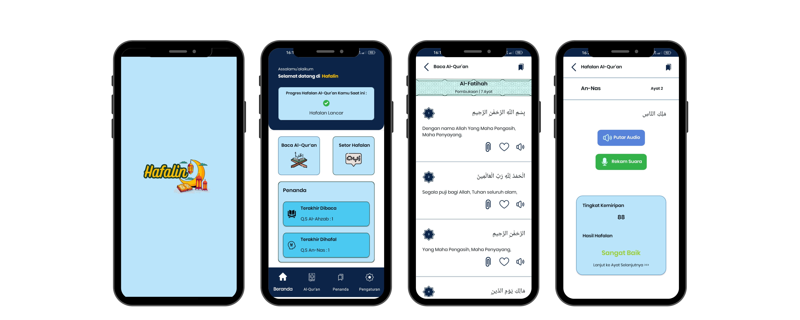
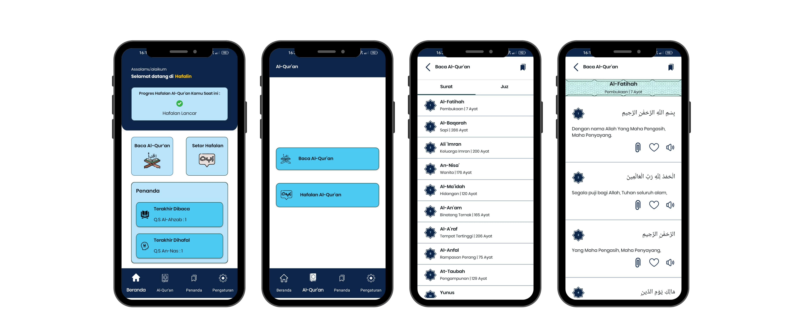
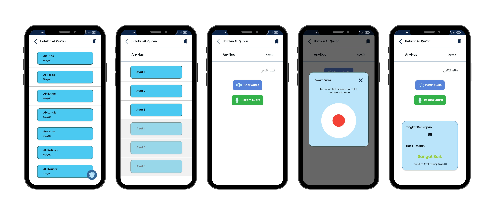
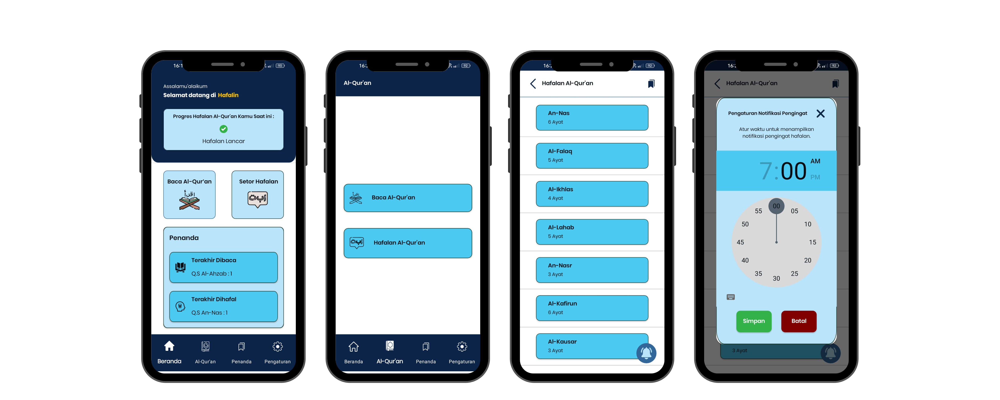

[![Contributors][contributors-shield]][contributors-url]
[![Forks][forks-shield]][forks-url]
[![Stargazers][stars-shield]][stars-url]
[![Issues][issues-shield]][issues-url]
[![MIT License][license-shield]][license-url]
[![LinkedIn][linkedin-shield]][linkedin-url]

<!-- PROJECT LOGO -->
 

  

  <h1 align="center">Hafalin Mobile App</h3>

  

    A great application that can enhance Quran memorization.
     
    <a href="https://github.com/acalapatih/OneAyat_mobileApp"><strong>Explore the docs »</strong></a>
     
     
    <a href="https://github.com/acalapatih/OneAyat_mobileApp">View Demo</a>
    ·
    <a href="https://github.com/acalapatih/OneAyat_mobileApp/issues">Report Bug</a>
    ·
    <a href="https://github.com/acalapatih/OneAyat_mobileApp/issues">Request Feature</a>
  

<!-- TABLE OF CONTENTS -->

  
Table of Contents

  <ol>
    <li><a href="#introduction">Introduction</a></li>
    <li><a href="#mock-up">Mock Up</a></li>
    <li><a href="#features">Features</a></li>
    <li>
      <a href="#about-the-project">About The Project</a>
      <ul>
        <li><a href="#build-with">Build With</a></li>
        <li><a href="#project-structure">Project Structure</a></li>
      </ul>
    </li>
  </ol>

## Introduction
OneAyat applies Speech To Text technology with the One Day One Ayat Method to facilitate independent Quran memorization submissions. Additionally, this application also provides the entire Quran text that can be read and saved for bookmarking purposes.

## Mock Up

### Quran Recitation Feature

### Quran Memorization Feature

### Reminder Notification Feature

## Features
- Splash Screen
- Read the Quran and its Translation
- Quran Memorization Submission
- Quran Memorization Detection
- Reminder Notifications
- Verse Bookmarking
- Memorization Status
 
## About The Project
### Build With
- [Lifecycle & Livedata](https://developer.android.com/guide/components/activities/activity-lifecycle?hl=id)
- [Retrofit](https://square.github.io/retrofit/)
- [Room](https://developer.android.com/codelabs/android-room-with-a-view-kotlin)
- [Navigation Component](https://developer.android.com/guide/navigation/get-started)
- [Notification Manager](https://developer.android.com/reference/android/app/NotificationManager)
- [Kotlin Coroutines](https://www.googleadservices.com/pagead/aclk?sa=L&ai=DChcSEwiU2bPz88f_AhXVk2YCHXdgDDMYABAAGgJzbQ&ohost=www.google.com&cid=CAESbOD2gWGIEaIzh7xPUOGICyK2tbXIr0QUhhlGSrurjKcD6swxwpKj-7IrQ9_iwmDhml1_P_z6seVQZZNvkJ-fiMxTpf1xONyVn40ucS143xA8HR8Y35CCv_06CgyhYufQQc6JFf2g1WPjknZFow&sig=AOD64_1YR8UhDwd6LH3WrvCacezcHvoFUw&q&adurl&ved=2ahUKEwiUqKzz88f_AhUT7TgGHSukAJEQ0Qx6BAgIEAE)
- [Ok Http 3](https://square.github.io/okhttp/)
- [GSON](https://github.com/google/gson)
- [Fragment](https://developer.android.com/guide/fragments?hl=id)
- [ViewModel](https://developer.android.com/topic/libraries/architecture/viewmodel?hl=id)
- [Koin](https://insert-koin.io/)
- [Google Speech API](https://cloud.google.com/speech-to-text)

### Project Structure
- core
  - data
    - repositoryImpl
    - source
      - local
      - remote
  - di
    - AppModule.kt
  - domain
    - interactor
    - model
    - repository
    - usecase
- ui
- utils

<!-- MARKDOWN LINKS & IMAGES -->
<!-- https://www.markdownguide.org/basic-syntax/#reference-style-links -->
[contributors-shield]: https://img.shields.io/github/contributors/acalapatih/OneAyat_mobileApp.svg?style=for-the-badge
[contributors-url]: https://github.com/acalapatih/OneAyat_mobileApp/graphs/contributors
[forks-shield]: https://img.shields.io/github/forks/acalapatih/OneAyat_mobileApp.svg?style=for-the-badge
[forks-url]:https://github.com/acalapatih/OneAyat_mobileApp/network/members
[stars-shield]: https://img.shields.io/github/stars/acalapatih/OneAyat_mobileApp.svg?style=for-the-badge
[stars-url]: https://github.com/acalapatih/OneAyat_mobileApp/stargazers
[issues-shield]: https://img.shields.io/github/issues/acalapatih/OneAyat_mobileApp.svg?style=for-the-badge
[issues-url]: https://github.com/acalapatih/OneAyat_mobileApp/issues
[license-shield]: https://img.shields.io/github/license/acalapatih/MobilePQI_mobileApp.svg?style=for-the-badge
[license-url]: https://github.com/acalapatih/OneAyat_mobileApp/blob/main/LICENSE
[linkedin-shield]: https://img.shields.io/badge/-LinkedIn-black.svg?style=for-the-badge&logo=linkedin&colorB=555
[linkedin-url]: https://linkedin.com/in/amir-acalapati-henry
